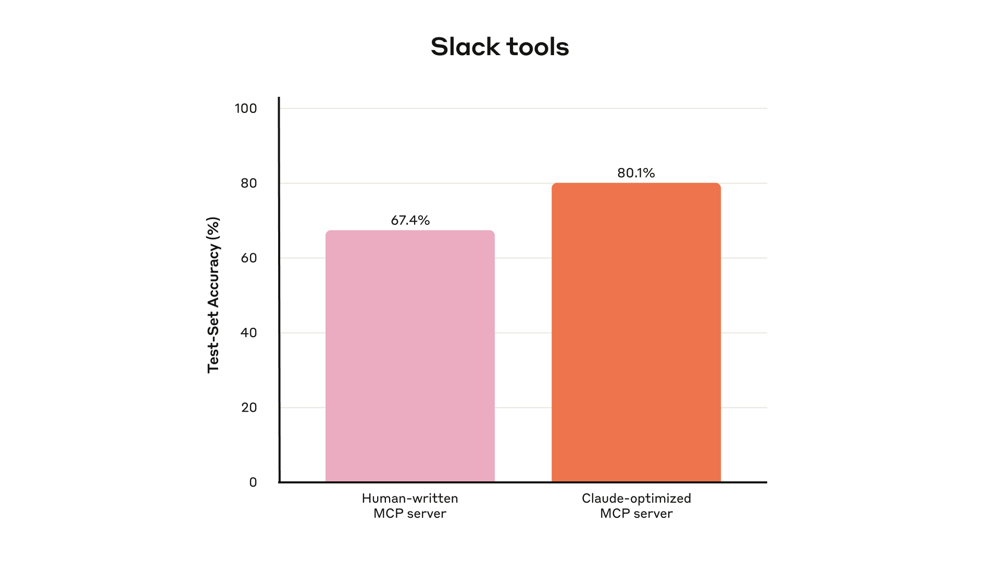
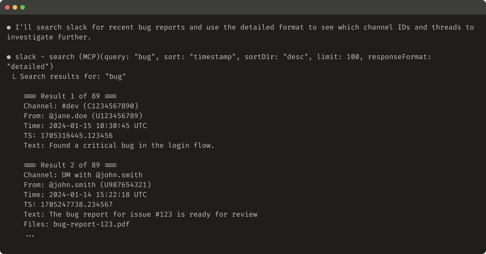

# 为 Agent 编写高效工具

[Model Context Protocol（MCP）](https://modelcontextprotocol.io/docs/getting-started/intro)可以让 LLM 智能体用上成百上千个工具去解决现实世界的任务。但怎样才能让这些工具发挥最大效用？

本文介绍 Anthropic 在各类智能体系统中提升表现最有效的一些技巧[^1]。

先讲怎么做：

- 搭建并测试工具原型
- 与智能体一起为工具创建并运行全面的评测
- 与 Claude Code 之类的智能体协作，自动提升工具的表现

最后总结 Anthropic 一路摸索出来的、写出高质量工具的关键原则：

- 选对该实现的工具（以及不该实现的）
- 用命名空间给工具划清功能边界
- 让工具把有意义的上下文返回给智能体
- 优化工具响应，提高 token 效率
- 为工具描述和规格做提示词工程


*搭好评测后，你就能系统地衡量工具的表现，并让 Claude Code 对照这份评测自动优化工具。*

## 什么是工具？

在计算领域，确定性系统在输入相同时每次都会产生相同的输出；而*非确定性*系统，比如智能体，即便起始条件一样，也可能给出不同的回应。

传统的软件开发，是在确定性系统之间订立契约。比如 `getWeather("NYC")` 这样的函数调用，每次被调用时都会以完全相同的方式获取纽约的天气。

工具则是一种新型软件，它体现的是确定性系统与非确定性智能体之间的契约。当用户问“今天要带伞吗？”时，智能体可能会调用天气工具，可能凭常识直接作答，甚至可能先反问一句所在的位置。偶尔，智能体还会产生幻觉，或者根本没弄明白该怎么用某个工具。

这意味着给智能体写软件时要从根本上换一种思路：不能再像给其他开发者或系统写函数和 API 那样去写工具和 [MCP 服务器](https://modelcontextprotocol.io/)，而是要为智能体来设计它们。

Anthropic 的目标，是扩大智能体能够有效解决任务的范围，让它们借助工具去尝试各种可行的策略。幸运的是，从 Anthropic 的经验看，对智能体来说最“顺手”的工具，往往对人来说也出奇地直观。

## 怎样写工具

这一节介绍如何与智能体协作，既让它们帮你写工具，也让它们帮你改进工具。先快速搭一个工具原型，在本地测试；接着跑一轮全面的评测，用来衡量之后的每次改动；然后与智能体一起反复评测、改进，直到智能体在真实任务上表现出色。

### 搭建原型

不亲手试一试，很难预判哪些工具智能体用起来顺手、哪些不顺手。所以先快速搭一个原型。如果你用 [Claude Code](https://www.anthropic.com/claude-code) 来写工具（甚至可能一次成型），最好把工具会依赖的软件库、API 或 SDK 的文档（可能也包括 [MCP SDK](https://modelcontextprotocol.io/docs/sdk)）提供给 Claude。对 LLM 友好的文档通常能在官方文档站的 `llms.txt` 纯文本文件里找到（这是 Anthropic [API 的版本](https://docs.anthropic.com/llms.txt)）。

把工具包装成一个[本地 MCP 服务器](https://modelcontextprotocol.io/docs/develop/connect-local-servers)或[桌面扩展](https://www.anthropic.com/engineering/desktop-extensions)（DXT），就能在 Claude Code 或 Claude 桌面应用里接入并测试。

要把本地 MCP 服务器接入 Claude Code，运行 `claude mcp add <name> <command> [args...]`。

要把本地 MCP 服务器或 DXT 接入 Claude 桌面应用，分别前往 `Settings > Developer` 或 `Settings > Extensions`。

工具也可以直接传入 [Anthropic API](https://docs.anthropic.com/en/docs/agents-and-tools/tool-use/overview) 调用，用程序化的方式测试。

自己先把工具试一遍，找出不顺手的地方。再收集用户的反馈，对你希望这些工具支持的用例和提示词建立直觉。

### 运行评测

接下来，你需要通过评测来衡量 Claude 用工具用得怎么样。先生成大量扎根于真实用途的评测任务。Anthropic 建议与智能体协作，让它帮你分析结果、判断如何改进工具。完整流程可参考 Anthropic 的[工具评测 cookbook](https://platform.claude.com/cookbook/tool-evaluation-tool-evaluation)。



*Anthropic 内部 Slack 工具在留出测试集上的表现*

**生成评测任务**

有了早期原型，Claude Code 就能快速探索你的工具，生成几十组提示词与回应的配对。提示词应当取材于真实用途，并基于真实的数据源和服务（比如内部知识库和微服务）。Anthropic 建议避开那些过于简单、流于表面的“沙盒”环境，它们的复杂度不足以对工具做压力测试。好的评测任务可能需要多次工具调用，甚至几十次。

一些好任务的例子：

- 下周和 Jane 约个会，讨论我们最新的 Acme Corp 项目。附上上次项目规划会的纪要，并预订一间会议室。
- 客户 ID 9182 反馈一次购买被扣了三次款。找出所有相关日志，并判断是否有其他客户受到同一问题影响。
- 客户 Sarah Chen 刚提交了取消申请。准备一份挽留方案。需要判断：（1）她为什么要走，（2）什么样的挽留方案最有吸引力，（3）在给出方案前需要注意哪些风险因素。

一些较弱的任务：

- 下周和 jane@acme.corp 约个会。
- 在支付日志里搜索 `purchase_complete` 和 `customer_id=9182`。
- 找出客户 ID 45892 的取消申请。

每条评测提示词都要配上一个可验证的回应或结果。验证器可以简单到把标准答案与采样回应做精确字符串比对，也可以复杂到请 Claude 来评判回应。要避免过于严苛的验证器，别因为格式、标点或合理的换一种说法这类无关差异而否定正确的回应。

对每组提示词与回应配对，你还可以选择标注你预期智能体在解题时会调用哪些工具，用来衡量智能体在评测中是否真正理解了每个工具的用途。不过，正确解题的路径可能不止一条，尽量别把策略规定得太死，也别对某种策略过拟合。

**运行评测**

Anthropic 建议用程序化的方式、直接调用 LLM API 来跑评测。使用简单的智能体循环（用 `while` 循环把 LLM API 调用和工具调用交替包起来），每个评测任务一个循环。每个评测智能体只拿到一条任务提示词和你的工具。

在评测智能体的系统提示词里，Anthropic 建议要求智能体不仅输出结构化的回应块（用于验证），还要输出推理和反馈块。要求智能体在工具调用和回应块*之前*先输出这些内容，可以触发思维链（CoT）行为，从而提升 LLM 的有效智能。

如果你用 Claude 跑评测，可以打开[交错思考](https://docs.anthropic.com/en/docs/build-with-claude/extended-thinking#interleaved-thinking)，“开箱即用”地获得类似的效果。这能帮你探究智能体为什么会调用或不调用某些工具，并指出工具描述和规格里具体该改进的地方。

除了最顶层的准确率，Anthropic 还建议收集其他指标：单次工具调用与单个任务的总耗时、工具调用总次数、token 总消耗，以及工具错误。跟踪工具调用能揭示智能体常走的工作流，也能发现一些可以把工具合并的机会。


*Anthropic 内部 Asana 工具在留出测试集上的表现*

**分析结果**

智能体是你发现问题、收集反馈的好帮手，从互相矛盾的工具描述，到低效的工具实现，再到令人困惑的工具 schema，都能给出意见。但要记住，智能体在反馈和回应里*没说*的，往往比说了的更重要。LLM 并不总是[言其所想](https://www.anthropic.com/research/tracing-thoughts-language-model)。

观察智能体在哪里被难住或搞糊涂了。通读评测智能体的推理和反馈（或者 CoT），找出不顺手的地方。查看原始记录（包括工具调用和工具响应），捕捉那些智能体没有在 CoT 里明说的行为。要会读言外之意；别忘了评测智能体未必知道正确答案和正确策略。

分析工具调用指标。大量冗余的工具调用可能意味着分页或 token 上限参数需要调整；大量因参数无效导致的工具错误可能意味着工具描述要写得更清楚，或者需要更好的示例。Anthropic 上线 Claude 的[网页搜索工具](https://www.anthropic.com/news/web-search)时，发现 Claude 会不必要地在工具的 `query` 参数后面加上 `2025`，导致搜索结果带偏、效果下降（Anthropic 通过改进工具描述把 Claude 引回了正道）。

### 与智能体协作

你甚至可以让智能体替你分析结果、改进工具。只需把评测智能体的记录拼接起来，粘贴进 Claude Code。Claude 很擅长分析记录并一次性重构大量工具，比如在引入新改动时确保工具实现与描述保持一致。

事实上，本文的大部分建议都来自 Anthropic 用 Claude Code 反复优化内部工具实现的过程。这些评测建立在 Anthropic 的内部工作区之上，复刻了内部工作流的复杂度，包含真实的项目、文档和消息。

Anthropic 依靠留出测试集来确保没有对“训练”用的评测过拟合。这些测试集表明，即便是“专家级”的工具实现（无论是研究人员手写的，还是 Claude 自己生成的），也仍有进一步提升表现的空间。

下一节会分享 Anthropic 在这个过程中学到的一些东西。

## 编写高效工具的原则

这一节把 Anthropic 的经验提炼成几条编写高效工具的指导原则。

### 为智能体选对工具

工具不是越多越好。Anthropic 观察到一个常见错误：不管这些工具是否适合智能体，直接把现有软件功能或 API 端点简单包一层就当成工具。问题在于，智能体与传统软件的“可供性”（affordance）不同，也就是说，它们感知“借助这些工具能做什么”的方式不一样。

LLM 智能体的“上下文”是有限的（一次能处理的信息量有上限），而计算机内存廉价又充裕。想想在通讯录里找联系人这件事。传统程序可以高效地存储并逐条处理联系人列表，检查完一条再看下一条。

但如果 LLM 智能体调用的工具返回了*全部*联系人，它就得一个 token 一个 token 地读过去，把有限的上下文空间浪费在无关信息上（想象一下在通讯录里找人时从头到尾一页页翻，也就是暴力搜索）。更好也更自然的做法（对智能体和人都一样）是先直接跳到相关的那一页（比如按字母顺序定位）。

Anthropic 建议先针对少数几个高价值的工作流，精心打造几个工具，让它们与你的评测任务相匹配，再从这里逐步扩展。在通讯录的例子里，你可以选择实现 `search_contacts` 或 `message_contact` 工具，而不是 `list_contacts` 工具。

工具可以整合功能，在底层处理*多个*独立操作（或 API 调用）。比如，工具可以在响应里附上相关的元数据，也可以把经常串联起来的多步任务放进一次工具调用里完成。

几个例子：

- 与其实现 `list_users`、`list_events` 和 `create_event` 三个工具，不如考虑实现一个 `schedule_event` 工具，由它来查找空闲时间并安排日程。
- 与其实现 `read_logs` 工具，不如考虑实现 `search_logs` 工具，只返回相关的日志行和少量上下文。
- 与其实现 `get_customer_by_id`、`list_transactions` 和 `list_notes` 三个工具，不如实现一个 `get_customer_context` 工具，一次性汇总客户近期所有相关信息。

确保你构建的每个工具都有清晰、独特的用途。工具应当让智能体像拥有同样底层资源的人那样去拆分和解决任务，同时减少原本会被中间输出占用的上下文。

工具太多或者功能重叠，也会让智能体分心，偏离高效的策略。审慎、有选择地规划要构建（和不构建）的工具，回报会非常可观。

### 给工具划分命名空间

你的 AI 智能体可能会接入几十个 MCP 服务器和几百个不同的工具，其中还包括其他开发者写的。当工具功能重叠或用途含糊时，智能体就会搞不清该用哪一个。

命名空间（把相关工具归到共同的前缀下）有助于在大量工具之间划清边界；有些 MCP 客户端默认就会这么做。比如按服务划分（`asana_search`、`jira_search`）和按资源划分（`asana_projects_search`、`asana_users_search`），都能帮智能体在合适的时机选中合适的工具。

Anthropic 发现，选择前缀式还是后缀式的命名空间，对工具使用评测的影响并不小。这种影响因 LLM 而异，建议你根据自己的评测来选定命名方案。

智能体可能调错工具、用错参数调对了工具、调用的工具太少，或者错误地处理工具响应。有选择地实现那些名字能反映任务自然划分的工具，既能减少加载进智能体上下文的工具数量和工具描述，又能把智能体的推理计算从上下文卸载回工具调用本身。这会整体降低智能体犯错的风险。

### 让工具返回有意义的上下文

同理，工具实现应当注意只把高信号的信息返回给智能体。优先考虑上下文相关性而非灵活性，避开底层的技术标识符（比如 `uuid`、`256px_image_url`、`mime_type`）。像 `name`、`image_url`、`file_type` 这样的字段，更有可能直接影响智能体后续的行动和回应。

智能体处理自然语言的名称、术语或标识符，也明显比处理晦涩的标识符更成功。Anthropic 发现，仅仅是把任意的字母数字 UUID 换成语义更明确、更可解读的表达（甚至只是从 0 开始编号的 ID 方案），就能通过减少幻觉显著提升 Claude 在检索任务中的精确度。

在某些情况下，智能体可能需要同时使用自然语言和技术标识符两种输出，哪怕只是为了触发后续的工具调用（比如 `search_user(name='jane')` → `send_message(id=12345)`）。你可以在工具里暴露一个简单的 `response_format` 枚举参数来兼顾两者，让智能体自己控制工具返回 `"concise"`（精简）还是 `"detailed"`（详细）的响应（见下图）。

你还可以增加更多格式以获得更大的灵活性，类似 GraphQL 那样精确选择想要接收哪些信息。下面是一个用来控制工具响应详略程度的 ResponseFormat 枚举示例：

```typescript
enum ResponseFormat {
   DETAILED = "detailed",
   CONCISE = "concise"
}
```

这是一个详细工具响应的例子（206 个 token）：



这是一个精简工具响应的例子（72 个 token）：


Slack 的话题（thread）和话题回复由唯一的 `thread_ts` 标识，获取话题回复时必须提供它。`thread_ts` 和其他 ID（`channel_id`、`user_id`）可以从 `"detailed"` 响应中取得，供后续需要这些 ID 的工具调用使用。`"concise"` 响应只返回话题内容，不含 ID。在这个例子里，`"concise"` 响应只用了约三分之一的 token。

甚至工具响应的结构（比如 XML、JSON 还是 Markdown）也会影响评测表现：没有放之四海而皆准的方案。这是因为 LLM 是用下一个 token 预测训练出来的，对与训练数据相符的格式往往表现更好。最优的响应结构会因任务和智能体而大不相同。建议你根据自己的评测来选择最合适的响应结构。

### 优化工具响应，提高 token 效率

优化上下文的质量很重要，但优化工具响应返回给智能体的上下文*数量*同样重要。

对任何可能吃掉大量上下文的工具响应，Anthropic 建议实现分页、范围选择、过滤和截断中的某几种组合，并给出合理的默认参数值。在 Claude Code 里，工具响应默认被限制在 25,000 个 token 以内。Anthropic 预计智能体的有效上下文长度会随时间增长，但对上下文高效工具的需求会一直存在。

如果你选择截断响应，务必用有用的提示来引导智能体。你可以直接鼓励智能体采用更省 token 的策略，比如在知识检索任务中多做几次小而精准的搜索，而不是一次大范围的搜索。同样，如果工具调用出错（比如输入校验失败），你可以对错误响应做提示词工程，清楚地传达具体、可操作的改进建议，而不是晦涩的错误码或堆栈信息。

这是一个截断响应的例子：


这是一个没有帮助的错误响应的例子：


这是一个有帮助的错误响应的例子：


工具的截断和错误响应，可以把智能体引向更省 token 的工具使用行为（使用过滤或分页），或者给出格式正确的工具输入示例。

### 为工具描述做提示词工程

现在来到改进工具最有效的方法之一：为工具描述和规格做提示词工程。因为它们会被加载进智能体的上下文，合起来就能把智能体引向高效的工具调用行为。

写工具描述和规格时，想想你会怎么向团队里的新同事介绍这个工具。想想那些你可能不自觉带入的隐含上下文，比如特殊的查询格式、小众术语的定义、底层资源之间的关系，把它们明确写出来。清楚地描述（并用严格的数据模型来约束）预期的输入和输出，避免歧义。尤其是输入参数的命名不能含糊：与其叫 `user`，不如叫 `user_id`。

有了评测，你就能更有把握地衡量提示词工程的效果。哪怕只是对工具描述的小幅打磨，也可能带来显著的提升。Claude Sonnet 3.5 在 [SWE-bench Verified](https://www.anthropic.com/engineering/swe-bench-sonnet) 评测中取得了当时最先进的成绩，正是因为 Anthropic 对工具描述做了精确的打磨，大幅降低了错误率、提高了任务完成率。

关于工具定义的其他最佳实践，可参阅 Anthropic 的[开发者指南](https://docs.anthropic.com/en/docs/agents-and-tools/tool-use/implement-tool-use#best-practices-for-tool-definitions)。如果你是给 Claude 写工具，还建议了解工具是如何被动态加载进 Claude 的[系统提示词](https://docs.anthropic.com/en/docs/agents-and-tools/tool-use/implement-tool-use#tool-use-system-prompt)的。最后，如果你是给 MCP 服务器写工具，[工具注解](https://modelcontextprotocol.io/specification/2025-06-18/server/tools)可以标明哪些工具需要开放世界的访问权限，或者会做破坏性修改。

## 展望

要为智能体构建高效的工具，我们需要把软件开发实践从可预测的确定性模式，转向非确定性模式。

通过本文描述的这种迭代式、评测驱动的过程，Anthropic 找到了让工具成功的一些共同规律：高效的工具有明确而清晰的定义，审慎地使用智能体的上下文，能在多样的工作流中组合使用，并让智能体能够直观地解决现实世界的任务。

未来，智能体与外部世界交互的具体机制预计还会演进，从 MCP 协议的更新，到底层 LLM 本身的升级。只要用系统化、评测驱动的方法持续改进给智能体的工具，就能确保智能体的能力越来越强的同时，它们所用的工具也一起进化。

[^1]: 训练底层 LLM 本身除外。

---

*参考文章：[Writing effective tools for agents — with agents](https://www.anthropic.com/engineering/writing-tools-for-agents)*
