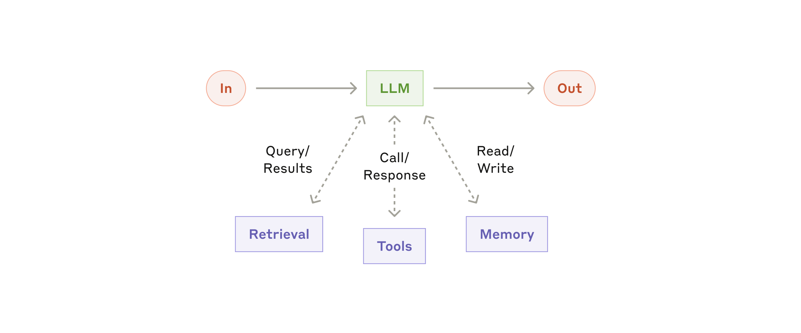
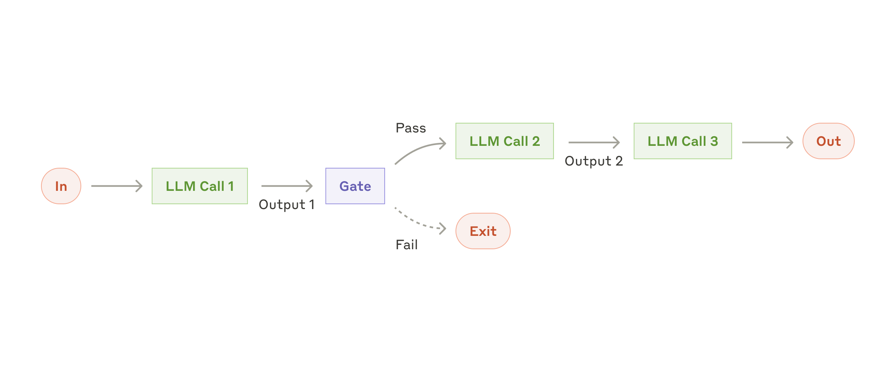
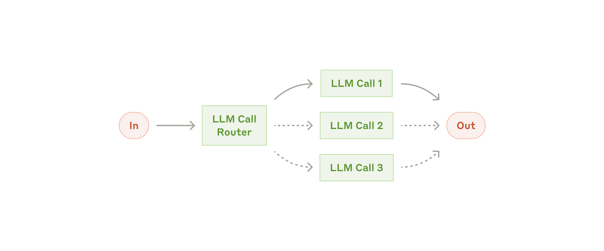
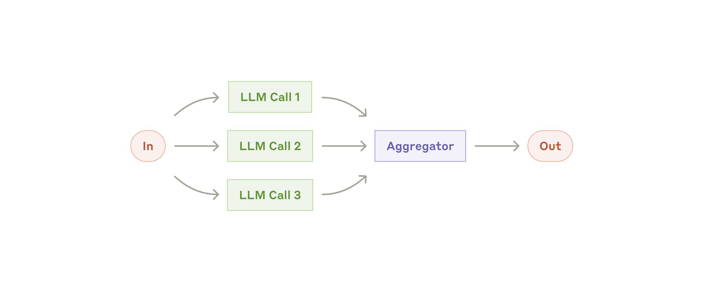
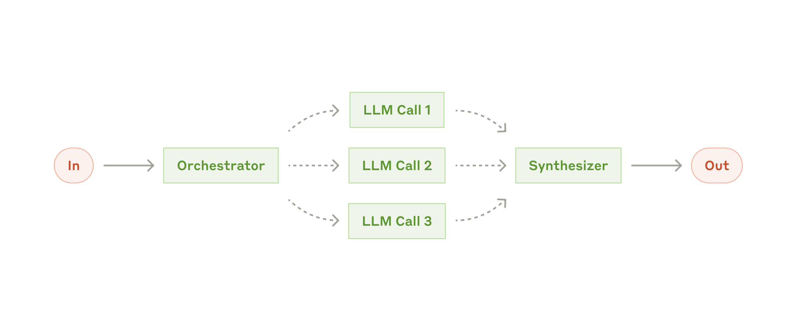
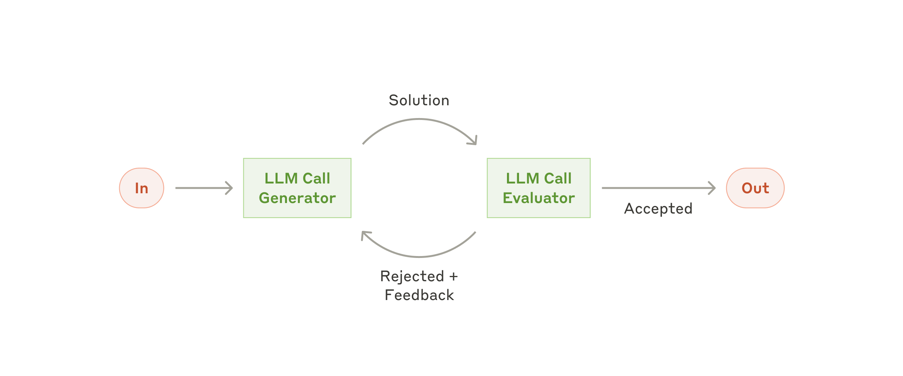
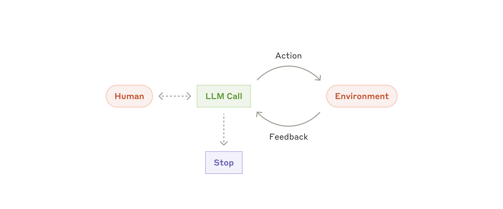
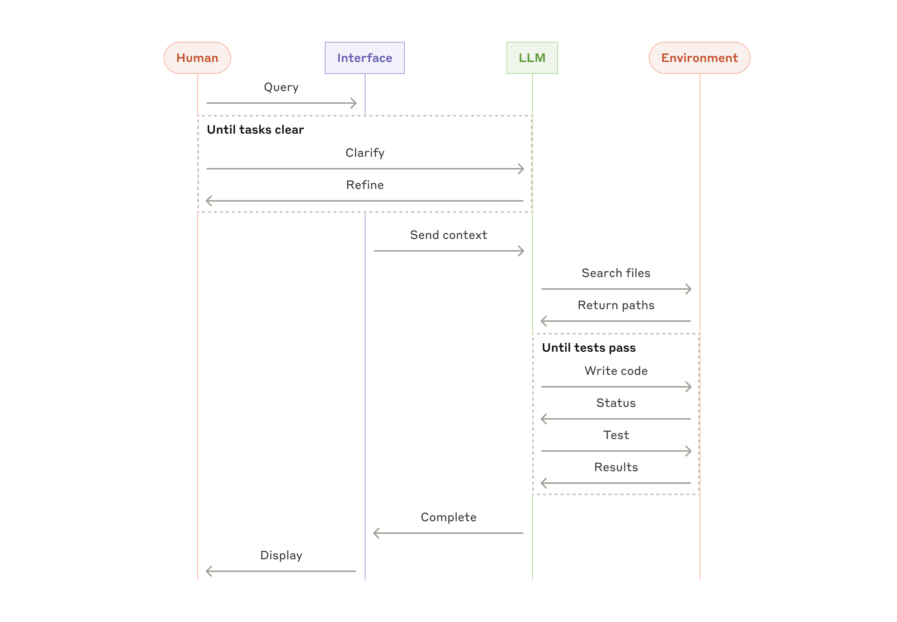

# 构建高效的智能体

:::note
本文所描述的工具生态自 2024 年 12 月以来已发生很大变化。Anthropic 当前的做法请参阅 [Claude Managed Agents 的构建历程](https://www.anthropic.com/engineering/managed-agents)与 [Managed Agents 文档](https://platform.claude.com/docs/en/managed-agents/overview)。
:::

过去一年，Anthropic 与各行各业数十个正在构建大语言模型（LLM）智能体的团队合作。一个反复出现的规律是：最成功的实现并没有依赖复杂的框架或专门的库，而是用简单、可组合的模式搭建起来的。

本文分享 Anthropic 在服务客户与自行构建智能体的过程中积累的经验，并为开发者构建高效智能体给出实用建议。

## 什么是智能体？

“智能体”（Agent）有好几种定义。有些客户把智能体定义为完全自主的系统：它们能长时间独立运行，借助各种工具完成复杂任务。另一些人则用这个词指代更规范化的实现，即按预先定义好的工作流执行。在 Anthropic，这些变体被统称为**智能体系统**（agentic systems），但在架构上会对**工作流**（workflow）和**智能体**（agent）做一个重要区分：

- **工作流**：由预先写好的代码路径来编排 LLM 和工具的系统。
- **智能体**：由 LLM 动态决定自己的执行过程和工具用法、自主掌控完成任务方式的系统。

下面会详细探讨这两类智能体系统。附录 1（“智能体的实践”）介绍了客户在两个领域里从这类系统中获得的显著价值。

## 何时该用（以及何时不该用）智能体

用 LLM 构建应用时，Anthropic 建议先找最简单的解决方案，只在必要时才增加复杂度。这可能意味着根本不需要构建智能体系统。智能体系统通常是用更高的延迟和成本换取更好的任务表现，你需要想清楚这笔交换在什么情况下划算。

当确实需要更高的复杂度时：对于定义清晰的任务，工作流能提供可预测性和一致性；而当需要在规模化场景下保持灵活、让模型来做决策时，智能体是更好的选择。不过对很多应用来说，把单次 LLM 调用配合检索和上下文示例优化好，通常就已经足够。

## 何时以及如何使用框架

有许多框架能让智能体系统更容易实现，包括：

- [Claude Agent SDK](https://platform.claude.com/docs/en/agent-sdk/overview)；
- AWS 的 [Strands Agents SDK](https://strandsagents.com/latest/)；
- [Rivet](https://rivet.ironcladapp.com/)，一个拖拽式的图形化 LLM 工作流构建器；
- [Vellum](https://www.vellum.ai/)，另一个用于构建和测试复杂工作流的图形化工具。

这些框架简化了调用 LLM、定义和解析工具、串联多次调用等标准的底层工作，让上手变得容易。但它们往往会额外引入抽象层，把底层的提示词和响应遮住，加大调试难度；还容易诱使你在一个简单方案本已足够的时候堆砌复杂度。

Anthropic 建议开发者先直接使用 LLM API：许多模式用几行代码就能实现。如果你确实要用框架，请确保理解其底层代码。对框架内部机制的错误假设，是客户出错的常见原因。

一些示例实现可参考 Anthropic 的 [cookbook](https://platform.claude.com/cookbook/patterns-agents-basic-workflows)。

## 基础构件、工作流与智能体

本节探讨 Anthropic 在生产环境中见到的智能体系统常见模式。先从基础构件——增强型 LLM——讲起，再逐步增加复杂度，从简单的组合式工作流一直讲到自主智能体。

### 基础构件：增强型 LLM

智能体系统的基本构件，是一个经过检索、工具、记忆等能力增强的 LLM。Anthropic 当前的模型已经能主动运用这些能力：自己生成搜索查询、挑选合适的工具、决定要保留哪些信息。

*增强型 LLM*

Anthropic 建议在实现时重点关注两件事：一是把这些能力针对你的具体用例做定制；二是确保它们为 LLM 提供简单、文档完善的接口。实现这些增强的方式很多，其中之一是使用 Anthropic 近期发布的 [Model Context Protocol](https://www.anthropic.com/news/model-context-protocol)，开发者只需一个简单的[客户端实现](https://modelcontextprotocol.io/tutorials/building-a-client#building-mcp-clients)，就能接入不断壮大的第三方工具生态。

本文后续内容都假设每次 LLM 调用都具备这些增强能力。

### 工作流：提示词链

提示词链（prompt chaining）把一个任务分解成一系列步骤，每次 LLM 调用处理上一步的输出。你可以在任意中间步骤加入程序化检查（见下图中的“gate”），确保整个流程仍在正轨上。

*提示词链工作流*

**适用场景：** 任务能够轻松、干净地拆成固定子任务时，这个工作流最为理想。它的主要目标是用延迟换取更高的准确率：让每一次 LLM 调用都变成一个更简单的任务。

**提示词链的典型用例：**

- 先生成营销文案，再把它翻译成另一种语言。
- 先写一份文档大纲，检查大纲是否满足特定标准，再依据大纲撰写文档。

### 工作流：路由

路由（routing）先对输入进行分类，再把它导向专门的后续任务。这种工作流可以实现关注点分离，构建更专门化的提示词。如果没有它，针对某一类输入的优化可能会损害其他输入上的表现。

*路由工作流*

**适用场景：** 路由适合这样的复杂任务：存在若干界限分明、分开处理效果更好的类别，并且分类本身可以被准确完成——无论是由 LLM 来分类，还是用更传统的分类模型或算法。

**路由的典型用例：**

- 把不同类型的客服请求（一般咨询、退款申请、技术支持）导向不同的下游流程、提示词和工具。
- 把简单、常见的问题路由给 Claude Haiku 4.5 这类更小、更省成本的模型，把困难、少见的问题路由给 Claude Sonnet 4.5 这类能力更强的模型，以兼顾效果与成本。

### 工作流：并行化

有时 LLM 可以同时处理同一个任务的不同部分，再用程序把各自的输出聚合起来。这种工作流即并行化（parallelization），有两种主要形式：

- **分段**（sectioning）：把任务拆成彼此独立、可以并行运行的子任务。
- **投票**（voting）：把同一个任务运行多次，得到多样化的输出。

*并行化工作流*

**适用场景：** 当拆出来的子任务可以并行执行以提高速度，或者需要多个视角、多次尝试来提高结果置信度时，并行化很有效。对于需要兼顾多个方面的复杂任务，让每个方面由单独的 LLM 调用来处理，通常能表现得更好，因为每次调用都能把注意力集中在一个具体方面。

**并行化的典型用例：**

- **分段**：
  - 实现护栏：一个模型实例处理用户请求，另一个实例筛查其中是否有不当内容或请求。这通常比让同一次 LLM 调用既负责护栏又负责核心回复效果更好。
  - 自动化评测 LLM 表现：每次 LLM 调用评估模型在给定提示词下表现的不同方面。
- **投票**：
  - 审查一段代码是否存在漏洞：用几个不同的提示词分别审查代码，发现问题就标记出来。
  - 判断一段内容是否不当：多个提示词分别评估不同方面，或设置不同的投票阈值，以平衡误报与漏报。

### 工作流：编排器—工作者

在编排器—工作者（orchestrator-workers）工作流中，一个中心 LLM 动态地分解任务，把子任务委派给工作者 LLM，再把它们的结果综合起来。

*编排器—工作者工作流*

**适用场景：** 这个工作流非常适合无法预先知道需要哪些子任务的复杂任务（以编程为例，需要修改的文件数量以及每个文件的改法，很可能都取决于具体任务）。它在拓扑上与并行化相似，但关键区别在于灵活性：子任务不是预先定义好的，而是由编排器根据具体输入来决定。

**编排器—工作者的典型用例：**

- 每次都要对多个文件做复杂修改的编程产品。
- 需要从多个来源收集并分析信息、找出可能相关内容的搜索任务。

### 工作流：评估器—优化器

在评估器—优化器（evaluator-optimizer）工作流中，一次 LLM 调用负责生成回复，另一次调用负责评估并给出反馈，两者循环往复。

*评估器—优化器工作流*

**适用场景：** 当有明确的评估标准，并且迭代打磨能带来可衡量的价值时，这个工作流尤其有效。判断是否合适有两个标志：其一，当人类把反馈明确表达出来后，LLM 的回复能得到明显改进；其二，LLM 自己也能给出这样的反馈。这类似于人类写作者打磨一篇文档时的反复修改过程。

**评估器—优化器的典型用例：**

- 文学翻译：译者 LLM 一开始可能抓不住某些微妙之处，而评估者 LLM 能给出有用的批评意见。
- 需要多轮搜索和分析才能收集到全面信息的复杂搜索任务，由评估器决定是否还需要继续搜索。

### 智能体

随着 LLM 在理解复杂输入、推理与规划、可靠地使用工具、从错误中恢复等关键能力上日趋成熟，智能体正在生产环境中崭露头角。智能体的工作始于人类用户的一条指令，或与用户的一段交互式讨论。任务明确之后，智能体便自主规划并执行，过程中可能回头向人类索取更多信息或请求判断。执行期间，智能体在每一步都要从环境中获得“基准事实”（ground truth，例如工具调用结果或代码执行结果）来评估自己的进展，这一点至关重要。智能体可以在检查点或遇到阻碍时暂停，等待人类反馈。任务通常在完成时终止，但为了保持可控，加入停止条件（比如最大迭代次数）也很常见。

智能体能处理复杂的任务，但它们的实现往往很简单：通常就是一个 LLM 在循环中根据环境反馈使用工具。因此，清晰、周到地设计工具集及其文档至关重要。附录 2（“为你的工具做提示词工程”）会展开讲工具开发的最佳实践。

*自主智能体*

**智能体的适用场景：** 智能体适用于开放式问题：难以甚至无法预知需要多少步骤，也没法硬编码一条固定路径。LLM 可能会运行许多轮，你必须对它的决策有一定程度的信任。智能体的自主性使其非常适合在可信环境中规模化地处理任务。

智能体的自主特性也意味着更高的成本，以及错误层层累积的可能。Anthropic 建议在沙盒环境中进行充分测试，并配以恰当的护栏。

**智能体的典型用例：**

以下示例来自 Anthropic 自己的实现：

- 一个用于解决 [SWE-bench 任务](https://www.anthropic.com/research/swe-bench-sonnet)的编程智能体，这类任务需要根据任务描述修改多个文件；
- Anthropic 的 [“computer use”参考实现](https://github.com/anthropics/anthropic-quickstarts/tree/main/computer-use-demo)，让 Claude 操作计算机来完成任务。

*编程智能体的高层流程*

## 组合与定制这些模式

这些构件并不是硬性规定，而是开发者可以根据不同用例来塑造和组合的常见模式。和任何 LLM 功能一样，成功的关键在于衡量表现并不断迭代实现。再强调一次：*只有*在复杂度能被证明确实改善了结果时，才考虑增加它。

## 总结

在 LLM 领域取得成功，靠的不是构建最精巧的系统，而是构建*适合*你需求的系统。从简单的提示词开始，通过全面的评测来优化，只有当更简单的方案力有不逮时，才引入多步骤的智能体系统。

在实现智能体时，Anthropic 会尽量遵循三条核心原则：

1. 保持智能体设计的**简单**。
2. 通过明确展示智能体的规划步骤，把**透明**放在优先位置。
3. 通过完善的工具**文档与测试**，精心打造你的智能体—计算机接口（ACI）。

框架能帮你快速起步，但在走向生产时，不要犹豫于减少抽象层、用基础组件来构建。遵循这些原则，你构建出的智能体不仅强大，还将可靠、可维护，并赢得用户的信任。

## 附录 1：智能体的实践

Anthropic 在与客户合作中发现了两个特别有前景的 AI 智能体应用，它们展示了上文所述模式的实际价值。这两个应用都说明：在既需要对话又需要行动、有明确的成功标准、能形成反馈闭环、并且融入了有意义的人工监督的任务上，智能体的价值最大。

### A. 客户支持

客户支持把人们熟悉的聊天机器人界面与工具集成带来的增强能力结合在一起。它天然适合更开放式的智能体，因为：

- 客服交互天然遵循对话流程，同时又需要访问外部信息、执行外部操作；
- 可以集成工具来拉取客户数据、订单历史和知识库文章；
- 退款、更新工单等操作可以通过程序完成；
- 成功与否可以通过用户定义的问题解决标准来清晰衡量。

已有多家公司通过基于用量的定价模式验证了这条路的可行性：只对成功解决的问题收费，这体现了它们对自家智能体效果的信心。

### B. 编程智能体

软件开发领域已展现出 LLM 功能的巨大潜力，能力从代码补全一路演进到自主解决问题。智能体在这里尤其有效，因为：

- 代码方案可以通过自动化测试来验证；
- 智能体可以把测试结果当作反馈，迭代改进方案；
- 问题空间定义清晰、结构良好；
- 输出质量可以客观衡量。

在 Anthropic 自己的实现中，智能体现在仅凭 pull request 的描述，就能解决 [SWE-bench Verified](https://www.anthropic.com/research/swe-bench-sonnet) 基准测试里真实的 GitHub issue。不过，自动化测试虽然有助于验证功能，人工审查对于确保方案符合更广泛的系统要求仍然至关重要。

## 附录 2：为你的工具做提示词工程

无论你构建的是哪种智能体系统，工具都很可能是智能体的重要组成部分。[工具](https://www.anthropic.com/news/tool-use-ga)让 Claude 能与外部服务和 API 交互，方式是在 Anthropic 的 API 中指定工具的确切结构和定义。当 Claude 打算调用某个工具时，它的 API 响应里会包含一个 [tool use 块](https://docs.anthropic.com/en/docs/build-with-claude/tool-use#example-api-response-with-a-tool-use-content-block)。工具的定义和规范，值得投入与整体提示词同等的提示词工程精力。这个简短的附录介绍如何为你的工具做提示词工程。

同一个操作往往有好几种指定方式。比如，修改文件既可以写一个 diff，也可以重写整个文件；结构化输出既可以把代码放在 markdown 里返回，也可以放在 JSON 里返回。在软件工程里，这类差异只是形式上的，可以无损地互相转换。但对 LLM 来说，有些格式比另一些难写得多：写 diff 需要在写出新代码之前，就先在块头（chunk header）里算好有多少行会变化；把代码写在 JSON 里（相比 markdown）则要对换行和引号做额外的转义。

Anthropic 对选择工具格式的建议如下：

- 给模型足够的 token 去“思考”，别让它把自己写进死胡同。
- 让格式尽量贴近模型在互联网文本中自然见过的样子。
- 确保没有格式上的“额外负担”，比如必须精确数清几千行代码，或者要对写出的所有代码做字符串转义。

一条经验法则是：想想人们在人机交互（HCI）上投入了多少心思，然后准备在打造优秀的*智能体*—计算机接口（ACI）上投入同样多的心思。以下是一些具体思路：

- 站在模型的角度想。根据描述和参数，这个工具的用法是一目了然，还是需要仔细琢磨？如果你都需要琢磨，那模型多半也一样。一个好的工具定义通常包含用法示例、边界情况、输入格式要求，以及与其他工具之间清晰的界限。
- 怎样修改参数名或描述能让事情更显而易见？把它当成给团队里的初级开发者写一份出色的 docstring。当有很多相似工具时，这一点尤其重要。
- 测试模型如何使用你的工具：在 Anthropic 的 [workbench](https://console.anthropic.com/workbench) 里跑大量示例输入，看看模型会犯什么错，然后迭代。
- 给工具做[防错设计](https://en.wikipedia.org/wiki/Poka-yoke)（poka-yoke）。调整参数，让犯错变得更难。

在为 [SWE-bench](https://www.anthropic.com/research/swe-bench-sonnet) 构建智能体时，Anthropic 花在优化工具上的时间实际上比花在整体提示词上的还多。例如，Anthropic 发现当智能体离开根目录之后，模型在使用相对文件路径的工具时会出错。为了解决这个问题，Anthropic 把工具改成始终要求绝对路径，结果模型使用起来再也没出过错。

---

*参考文章：[Building Effective Agents](https://www.anthropic.com/engineering/building-effective-agents)*
