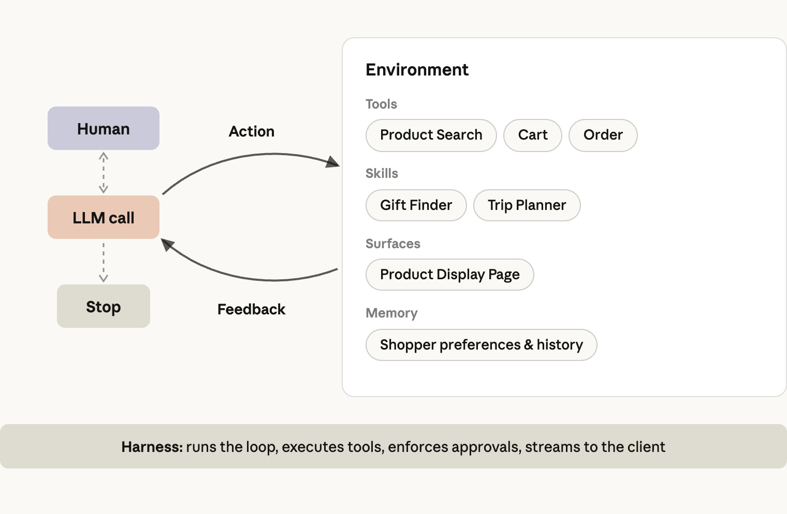
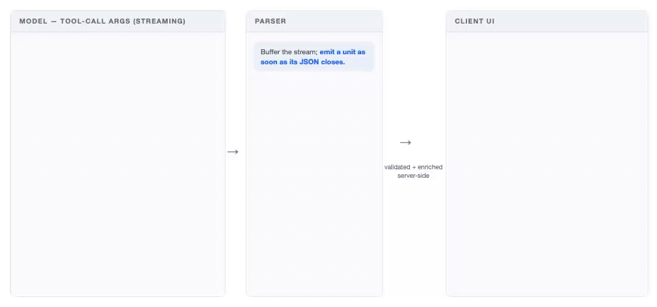
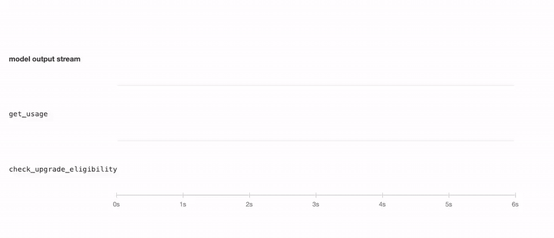
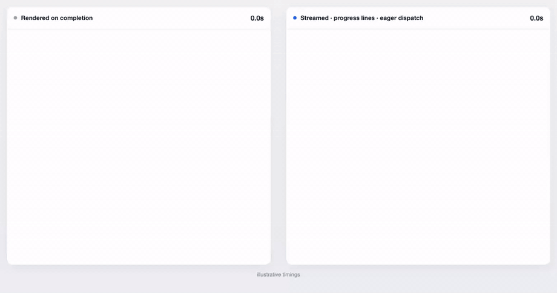
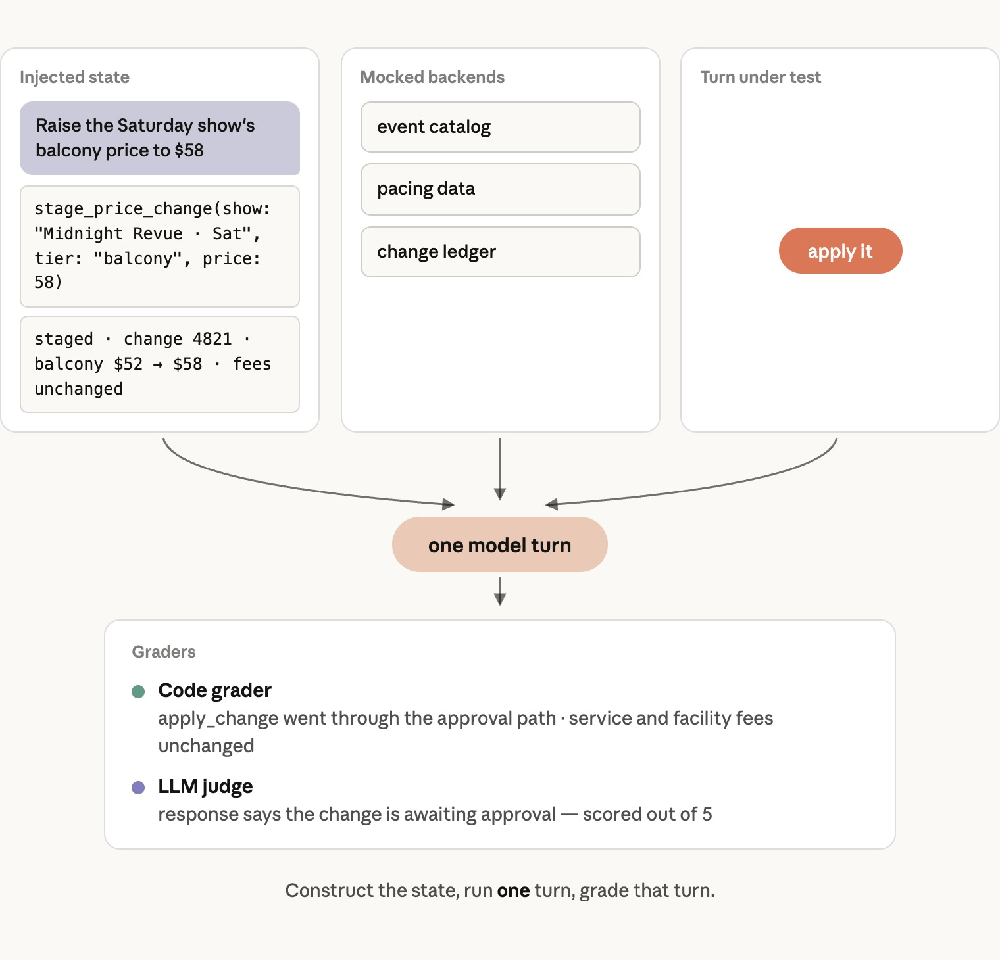

import { CardGrid, Card, LinkCallout, SkillList } from '@site/src/components/InfoCards';

# 高效商务 Agent 架构指南

让线上买卖更顺畅的 Agent：架构、延迟与成本技巧、评测实践。

:::note[来源]
本文译自 Anthropic 官方博客 [A guide to the anatomy of effective commerce agents](https://claude.com/blog/the-anatomy-of-effective-commerce-agents)，作者 Matthew Koen 与 Ali Shazal。
:::

过去一年里，我们与商务行业的众多团队合作——零售商、电商平台、旅行、娱乐和电信运营商——用 Claude 构建商务 Agent。

这些 Agent 已经在生产环境中运行，企业客户使用后看到了更大的购物车和更高效的卖家运营。它们还共享一套简单的架构：一个运行在 Agent 循环中的 Claude，配上一组技能、工具和一套扎实的评测集。

本文面向正在构建这类（或其他面向消费者的）Agent 的工程师与工程负责人。第一部分讲架构，这是你只需决定一次的事。第二部分讲延迟与成本。第三部分讲生产：记忆、安全、评测，以及如何在整个组织内推进这项工作。

<LinkCallout
  label="参考实现"
  href="https://github.com/anthropics/commerce-agents"
  linkText="anthropics/commerce-agents →"
>
  我们还提供了一份**蓝图**，帮助你在 Claude 上构建商务 Agent。它包含工程团队让商务 Agent 在几天内跑起来所需的 harness（运行 Agent 的宿主程序）、模式和护栏，并附有面向零售、旅行、电信和票务平台的购物 Agent 与商家 Agent 参考实现。
</LinkCallout>

## 01 架构

一个模型跑在标准的 Agent 循环里，用技能覆盖长尾需求，用工具调用你已有的系统。这件事你只需决定一次。

### 什么是商务 Agent？

我们把商务 Agent 定义为：让在线商品目录上的买卖变得更简单的 Agent。

有些 Agent 面向消费者：它们搜索、比较、替换，并组装出订单。这可能是一个零售购物车、一份旅行行程、一次手机套餐变更，或是为一场演出锁定的座位。有些 Agent 面向商家：它们回答销售问题，运行促销和营销活动，管理库存与定价。

核心架构是一个运行在[标准 Agent 循环](https://www.anthropic.com/engineering/building-effective-agents)中的模型：围绕目标推理，探索上下文，通过工具采取行动，通过技能学习流程，提出澄清问题，并观察结果，直到目标达成。

它前面没有一个把对话切分开的意图路由器，后面也没有一组按领域划分的专用 Agent。

### 工程化上下文

#### 用技能，而不是子代理

商务 Agent 需要覆盖众多品类和意图下的大量能力，这很容易让人想为每个领域建一个子代理。

实践中这种做法并不理想，因为一次商务对话是跨多个意图、多个轮次的一段紧密耦合的会话，需要大量共享的上下文。

在子代理架构里，编排器持有购物车或暂存变更、用户偏好和对话历史。

每一次向子代理的交接都是一次有状态损失的操作，这常常会影响子代理回复的质量，进而影响整体回复。除此之外，每次交接都可能消耗数倍的 token，并增加数秒的延迟。

各个领域也很少能干净地切分开。一个退货流程可能同时需要订单历史、当前购物车和商品目录，这意味着「一个领域一个子代理」的方案要么到处重复这些访问权限，要么在任务进行到一半时被迫交接。

随着模型变得更聪明，它们也能处理更长的上下文、更多的技能和更多的工具，所以今天这些「放哪里」的规则背后的限制，会随着每一代模型逐步放宽。

作为替代，[Agent 技能](https://platform.claude.com/docs/en/agents-and-tools/agent-skills/overview)能给你同样的按领域模块化和上下文控制能力，却没有交接的代价，因为技能指令会加载进已经持有完整历史的主 Agent 里。

在我们对多个企业部署的对比中，「单个 Agent + 技能」在质量上始终优于「一个提示词包打天下」和子代理这两种设计，而且每个任务的成本和延迟往往还更低。

子代理真正派上用场的场景，是编排器可以把它当作工具来调用，处理一个窄而自包含、且能从独立上下文窗口中受益的任务。

一个常见的生产例子是深度研究子代理：子代理搜索并阅读文档、编写并运行代码、遍历数据模型、碰到死胡同。所有这些工作都发生在一个或多个子代理内部，只有一个精简的答案返回给编排器。

另一个例外是已经有自己专用 Agent 的领域。如果你的药房或金融服务体验运行着一个带有独立合规面的专用 Agent，正确的做法可能是交接：由那个 Agent 接管任务，通过它自己的循环直接与用户协作，直到任务完成。

区别在于对话的所有权归谁。交接让领域 Agent 成为用户的对话方；而委托则让编排器保留所有权，在单个轮次内把领域 Agent 弹进弹出，每一次交换都会造成退化。

#### 放系统提示词还是放技能：按频率决定

决定一组指令放在系统提示词还是技能里，主要看 Agent 需要它的频率。加载一个技能要花掉一个模型轮次，所以 Agent 在大多数轮次都需要的东西，一般都放进系统提示词。

不过，这也取决于你的流量分布，以及评测显示出来的 Agent 行为。一个不错的起点是：凡是与三分之一以上流量相关的内容——无论是上线前预估的还是生产中观察到的——都放进系统提示词，其余放进技能。

如果某个技能可以从你已有的信号预测出来，比如用户是从哪个页面进来的，我们建议在第一次模型调用之前就由 harness 注入它，省掉加载技能的那一个额外轮次。

关键指令，比如安全与法律规则、品牌约束，以及过敏史这类关键用户事实，始终放在系统提示词里。

对商务 Agent 来说，这意味着商品搜索放在提示词里，因为几乎每个会话都会用到它；技能则承载功能的长尾。

在我们的[参考实现](https://github.com/anthropics/commerce-agents)中，购物 Agent 的提示词包含事实依据、购物车与结账语义以及展示规则，其余由下面这些技能覆盖：search-discovery、purchase-research、planning-goals、customer-care 和 memory-personalization。

商家 Agent 也是同样的拆法，技能为 performance-insights、catalog-listings、inventory-operations、pricing-promotions 和 marketing-campaigns，每个运营领域一个。

<CardGrid>
  <Card title="放在提示词里" sub="购物 Agent" tone="accent">
    事实依据、购物车与结账语义、展示规则，以及商品搜索。
  </Card>
  <Card title="购物技能" sub="长尾">
    <SkillList
      items={[
        ['search-discovery', '搜索与发现'],
        ['purchase-research', '购前调研'],
        ['planning-goals', '目标规划'],
        ['customer-care', '售后服务'],
        ['memory-personalization', '记忆与个性化'],
      ]}
    />
  </Card>
  <Card title="商家技能" sub="每个运营领域一个">
    <SkillList
      items={[
        ['performance-insights', '业绩洞察'],
        ['catalog-listings', '商品信息维护'],
        ['inventory-operations', '库存与运营'],
        ['pricing-promotions', '定价与促销'],
        ['marketing-campaigns', '营销活动'],
      ]}
    />
  </Card>
</CardGrid>

### 工程化 Agent 工具

我们在[为 Agent 编写高效工具](https://www.anthropic.com/engineering/writing-tools-for-agents)一文中讨论了工具设计的一般原则。在商务场景下，最重要的有两点：

**把 Agent 工具建在你的核心系统和逻辑之上。**

一家商务公司已经有搜索与排序、购物车、偏好与用户档案存储、库存系统、促销与营销活动引擎、销售分析等等，每一个都封装着多年调优的逻辑，并且能看到模型永远看不到的信号。

Agent 的工具应该调用这些系统，而不是重新实现它们；工具边界就是这些系统的逻辑终止、模型的判断接手的地方。

举例来说，当 Agent 调用 `search_products` 时，返回的结果应该已经排好序；Agent 的工作是决定哪些结果符合用户的目标、展示多少条、以及如何呈现。

**工具结果就是上下文。**

只返回模型用来推理的字段，其余的丢掉。每条搜索结果上都带图片 URL，是最常见的问题。

必要时在工具内部重塑原始响应，包括在数据本身看不出下一步该做什么时，附上一条下一步说明。

这在错误场景下尤其重要，模型从指令中获得的帮助远多于错误码。例如，用「查询库存时请带上商品 ID」这样的错误指令，取代一个笼统的 403。

#### UI 组件就是工具

大多数商务 Agent 的回复都是 UI 组件而不是文字——商品轮播、行程、座位图、图表。这意味着 Agent 输出的是一个 schema 而不是文本。

有些团队一开始会提示模型输出自定义标签，然后在客户端解析。随着界面变多，这种做法会失效，因为：

* 模型在你的标记语言上的训练远不如工具调用充分，所以随着嵌套组件的增加，可靠性会下降。仅靠提示词无法保证数据格式良好。
* 标签定义住在系统提示词里，所以每新增一个组件都会让上下文膨胀，每次编辑都可能让提示词的其他部分出现回归。
* 历史对话最终以一种只有你的解析器能读的格式存储，所以加载历史时要么在客户端解析原始消息，要么再存一份模型 API 不原生支持的副本。

经受住考验的模式是：把每个 UI 组件做成一个工具。模型带着类型化参数调用 `present_products`、`present_itinerary` 或 `present_plan_comparison`；你的服务端校验并补全这次调用，然后发出一个事件；你的客户端负责渲染。

由于组件就是工具调用，它们本来就以原生格式存在于 messages 数组中，重新加载旧对话时不需要再解析一遍。下面以及[参考仓库](https://github.com/anthropics/commerce-agents)中展示了一个展示工具契约的示例。

代价是流式输出的粒度。工具调用的每个顶层参数都会在服务端缓冲以做校验，所以即便开启了流式输出，展示工具的子组件也是分批到达的。这会影响感知延迟。

要获得 token 级别的流，可以在工具定义上设置 `eager_input_streaming: true`，它会跳过缓冲，也就跳过了服务端的 schema 保证。

在我们的评测中，Claude Sonnet 级别及以上的模型极少出现 schema 违规，但还是要给调用包一层重试，以应对偶尔漏网的情况。

展示工具还让 Agent 拥有一份「屏幕上有什么」的记录。当顾客说「第一家酒店」或「左边往下数第三个」时，布局就在 messages 数组里，在最后一次展示调用的参数中。

要让这一点成立，参数必须反映实际渲染的布局，所以要按 UI 的结构来组织参数——有序的行和轮播，而不是一个由客户端重新排列的扁平列表。

## 02 实现快速且经济

从端到端和感知两个层面攻克延迟问题，并让缓存承担成本。这一切都不应耗费智能来实现。

延迟在商务场景中很重要，而面向消费者的界面是最不宽容的。然而在 Agent 化的界面上，我们一直观察到真正推动留存、参与度和购物车规模等指标的，是结果的质量。

与延迟上的边际收益相比，答案是否相关、任务是否真正完成，对这些指标的影响要关键得多。

所以要从两个层面攻克延迟。通过扎实的工程把端到端延迟降到最低，同时配合降低感知延迟（因为看着 Agent 工作的时间会被理解为进展）。

每个用户都有一个延迟预算，下面这些技巧能让 Agent 保持在预算之内，而无需为此耗费智能。

### 最小化任务完成延迟

任务完成延迟等于所有模型轮次上「最后一个 token 的到达时间 + 工具处理时间」之和。这给了你三个可以发力的杠杆：更少的轮次、更快的工具、更快的 token。这些杠杆有时会相互竞争，所以要最小化的是总和，而不是其中任何一项。

<CardGrid numbered>
  <Card title="更少的轮次">
    预先加载可能用到的上下文，提升模型智能，并让模型并行调用相互独立的工具。
  </Card>
  <Card title="更快的工具">
    优化工具自身的后端，并在参数生成完毕时就提前派发工具。
  </Card>
  <Card title="更快的 token">
    通过在评测集上跑扫描来选择模型及其配置。
  </Card>
</CardGrid>

#### 更少的轮次

查询的复杂度会增加轮次，而这通常不在你的掌控之内。模型智能和相关的上下文能帮助 Agent 用更少的轮次完成任务。我们在这方面的一些关键经验包括：

* **预先加载可能用到的上下文。** 如果用户是从商品页打开助手的，或者商家是从营销活动看板打开的，就把那个页面的数据放进会话上下文。对话很可能就是围绕它展开的，而直接从上下文回答不会花掉额外的轮次。
* **提升模型智能。** 更聪明的模型能减少完成一个任务的总轮次，因为 Agent 能更高效地规划和发出工具调用。这往往能抵消它们较慢的 token 速度。如果你的查询偏复杂，或者生产数据显示每个任务超过五个轮次左右，那么更快的模型往往就是更聪明的那个。具体是哪一个取决于你的流量，所以要按下文「选择模型」所述通过扫描来决定。
* **让模型并行调用相互独立的工具。** 商务用例经常需要并行执行许多操作：搜索多个商品、查询多份政策文档、或从多个销售数据源拉取记录。并行工具调用能保证多个独立的查询不会消耗额外的轮次。提示模型在一个轮次内调用多个工具，并把结果作为一个工具结果数组放在一条用户消息里返回（参见[并行工具调用文档](https://platform.claude.com/docs/en/agents-and-tools/tool-use/parallel-tool-use)）。

#### 更快的工具

* **优化工具自身的后端。** 有时一个工具确实需要扇出——商家 Agent 的「获取今日概况」查询会通过三次独立调用读取销售、库存和营销活动状态。但我们更常看到的是，工具边界变成了拼接缺失后端逻辑的地方：一个库存检查先调商品目录查 SKU，再按门店调库存服务，再调履约服务查截止时间，然后在工具自己的代码里套用替换规则和自提资格，最后才作答。这个工具现在背负了过多的领域知识，规则一变就很难保持正确，而且承载着本应放在上游系统里的逻辑。当你发现自己在工具里写这种逻辑时，正确的修法是做一个能回答这个问题的后端端点，然后用 Agent 工具去调它。
* **提前派发工具。** 工具参数和其他 token 一样从模型里流式输出，所以 harness 可以在每个工具调用的参数生成完毕时就执行它，并在模型还在流式输出其他并行工具或内容块的同时处理它。我们见过这一招把数秒的空档压缩到几百毫秒，[Claude Agent SDK](https://code.claude.com/docs/en/agent-sdk/overview) 默认就是这么做的。要获得最大的延迟收益，你应该提示模型先发出最慢的那个调用。

### 感知延迟

感知延迟是用户感受到的、直到屏幕上有反应为止的时间。在面向消费者的用例中它尤其关键，任何交易摩擦都会影响结账率和收入。有两个技巧可以在不碰模型的前提下缩短它：

* **组件生成到哪里就流式输出到哪里。** 一条渲染出来的商务回复通常有 500–700 个输出 token，不用流式输出的话就是五秒甚至更久的转圈。把展示工具的每个参数在流式生成时就发给客户端，让页面逐步渲染。
* **展示工作过程。** 在 Agent 收集上下文时，为每一步渲染一行简短的进度文字（例如「正在查找海边的酒店」）。你可以从工具已有的参数生成（比如商品搜索的查询词），或者额外加一个 user_facing_message 参数，提示模型来写这一行。

*上面两个面板运行的是同一个 Agent，工具和提示词完全相同，只有 harness 不同。总耗时差不多，但用户看到内容的时间相差很大。*

### 提示词缓存

提示词缓存是你最大的降本候选，而商务流量非常适合它。缓存的输入 token 读取价格只有新鲜 token 的十分之一；虽然缓存写入有大约 1.25 倍的溢价，但一个缓存前缀在第二次使用时就回本了。在流量很大的面向客户的应用中，你有一个独特的机会：用最便宜的、默认 5 分钟的缓存过期时间就能达到非常高的缓存命中率。

我们见过的最好的商务部署运行在 90–99% 的缓存命中率上，这也是你从一开始就该按它来设计的区间。我们的经验还表明，在约 100k token 的规模下，缓存 token 的读取还能快 1.5 到 2 倍，而且 token 越多，提升越接近线性。

缓存是基于前缀的。一个请求会从缓存里读到与之前某个请求第一个不同的字节为止，所以重要的不只是上下文里有什么，还有它们的顺序。把一个请求想成三段，按变化频率排序：

* **全局段**：系统提示词的绝大部分和工具定义，在每个会话中都完全相同。这是你最热的缓存，在规模化之后大概率永远不会过期。让它在跨轮次、跨会话时保持逐字节一致，并在它的末尾放一个缓存断点。
* **会话段**：每个用户的上下文和对话历史，跨会话不同，但在一个会话内保持稳定。这一段放在全局段之后。
* **易变段**：会话内会变化的任何东西，比如当前时间或当前页面。把它放在请求的最末尾，要么作为最新一条用户轮次里的一个带标签的块，要么在支持[对话中系统消息](https://platform.claude.com/docs/en/build-with-claude/mid-conversation-system-messages)的模型上，作为一条 system 角色的消息追加到 messages 数组末尾。我们最常见到的错误，是把时间戳或当前页面放在系统提示词的开头，这会在每次请求时悄无声息地打破缓存。

这里有两个实现细节要记住。第一，技能应该作为工具结果加载，而不是追加到系统提示词里。这样技能正文会落在对话前缀中，随之一起被缓存。

第二，每个轮次都要把断点往前滚：一个请求允许的断点数量有限，所以要把最新的那个断点移到每个用户轮次的末尾。这样每一轮都能从缓存中读取累积的历史，包括搜索响应这类很长的工具结果。

### 选择模型及其配置

[模型规模和 effort 设置](https://claude.com/blog/claude-model-and-effort-level-in-claude-code)是同一种权衡——智能对延迟和成本——两者都应该通过测量来选择：

1. **确定你的指标和底线。** 选定你的业务赖以运转的质量指标（任务完成率、答案相关性、有据可查的准确性）、你不会低于的评测分数，以及你的 p50 和 p99 延迟与成本预算。
2. **跑扫描。** 在你会考虑的*每一个*模型和 effort 级别上跑完整的评测集。我们建议商家 Agent 从 Opus 起步，因为它们的任务以分析为主；面向消费者的 Agent 从 Sonnet 起步，因为延迟在那里权重更大。如果你有生产流量，就按真实的查询分布给结果加权。然后让数字来决定。有时 Opus 5 在推动购物车的任务上的提升值得它相对 Sonnet 的成本差，有时不值得。
3. **仔细读结果。** 有两件事经常让团队意外。第一，提示词是针对某个模型调优的，所以用一份提示词跑扫描，可能会让那些它不是为之编写的模型表现不佳。较小的模型通常需要当前模型能自行推断出来的指令，而较大的模型会一字不差地执行较小模型忽略掉的指令。在排除任何候选之前，先对每个候选的失败用例做几轮迭代，这是一个便宜的步骤。第二，更智能的配置有时反而在延迟上胜出（最常见于 p90 和 p99），尽管它的 token 更慢，因为它对工具调用的规划更好，在最复杂的请求上需要的轮次更少。

要按「每个完成的任务」而不是「每次模型调用」来度量成本，因为一个需要更多轮次、或者失败更频繁的便宜模型，并不便宜。当结果接近、而且成本符合你的单任务经济模型和延迟要求时，选择智能。质量才是推动采用和留存的东西，也为接下来 6 个月随着模型进步而继续构建留出了空间。

## 03 在生产环境中运行

记忆、安全、评测，以及在整个组织内推进这项工作：这些是让 Agent 通过生产考验并持续留在生产中的东西。

最后，我们来谈谈让 Agent 通过生产考验的东西：记忆、安全、评测，以及在整个组织内推进这项工作。

### 跨会话留存的记忆

你与客户之间的关系和互动很重要。记忆让 Agent 能从上次对话停下的地方接着来，而不是从零开始。一位在三月提到过坚果过敏的顾客，不应该在六月再说一遍；一位每周一都查看同样三个营销活动的商家，不应该每次都要报出它们的名字。长期记忆——那些应该跨会话留存的事实——是一个你需要自己构建的系统，它有三个部分：事实如何存储、如何写入、如何读取。

#### 存储记忆

记忆属于你的系统，而不是模型。

当用户档案很小、且 Agent 是唯一读者时，一份扁平的 markdown 档案就够用了。大多数生产级商务 Agent 都会超出这个阶段，务实的替代方案是你已经在运营的那个数据库。一条事实就是一条小的类型化记录：一个键（如 shoe_size、default_store、preferred_report_cadence）、一个简短的值、一个类别，以及它来自哪个会话。有些键由你预先定义，每个用户都有；其余的由提取器自行发现。数据库在存储量增长后依然可查询，能让你针对特定属性构建确定性的行为，还能与你已有的用户数据做关联。

对面向商家的 Agent，记忆要按人而不是按账号来建键。商家登录账号经常由多个操作员共用，所以每个操作员都需要自己的档案，而读取必须遵守该操作员的权限：门店经理的 Agent 不应该回忆起区域经理说过的事实。

在商务领域，Agent 记忆保存的是个人数据。值得记住的事实往往正是受监管最严的那些，而不同司法辖区的规则各不相同。把记忆当作一个数据处理的设计问题，而不仅仅是存储问题。实践中这意味着四件事：

* **决定你愿意保存哪些类型的记忆。** 在写入路径上强制执行，让每次保存都经过一个校验器，而不是只靠提示词。
* **给用户一个查看、更正和删除已存内容的途径。** 把删除接入你的账号注销和数据请求流程。
* **设定保留期限。** 几年前的偏好很可能已经过时，保留期限有助于让记忆事实保持新鲜。
* **记忆应该是一个按部署粒度的开关。** 这让无法承担这些义务的地区可以在关闭记忆的情况下运行。

#### 写入记忆

异步写入记忆。在每个轮次结束时，或者在长会话中每隔几个轮次，由另一个线程或进程里的 Agent 读取对话，并在存储中创建、更新或删除事实，同时随着会话推进维护它自己的工作上下文。

这不会给对话增加任何延迟，而且在我们内部的商务记忆评测集上，事实召回率提高了 13%。

显而易见的替代方案——让 Agent 调用一个工具来保存事实——对延迟敏感的商务 Agent 来说是错误的选择。每次保存都是一次发生在面向用户轮次内的工具调用，而且除非整个存储都在上下文里，否则保存前需要先读一次以便更新或去重，这本身又是一个轮次。

它还在每个轮次都给 Agent 多塞了一个要做的决定，在我们的评测中，这种对注意力的争夺表现为漏掉的记忆。

把提取器分离出来，还能让你精确地为它写提示词。它只读用户和助手的文本，从不读工具结果，所以一段商品描述或一条评论不可能变成关于用户的事实。它的提示词写明什么算事实——明确说出的尺码、饮食限制、履约偏好、商家惯用的物化视图——什么不算，比如任何来自商品条目的内容或一次性的细节。

#### 读取记忆

分三层读取记忆。

<CardGrid numbered>
  <Card title="始终在上下文中">
    一小组固定的事实每个轮次都进入上下文：几乎每个请求都依赖的那些，比如顾客的默认门店和履约偏好，或操作员的门店和角色。
  </Card>
  <Card title="每轮预取">
    与当前请求相关的事实，每个轮次用预加载技能的同一套信号预取出来：一次鞋子搜索拉出尺码和品牌偏好，一个营销活动问题拉出操作员惯用的指标。
  </Card>
  <Card title="放在查询工具之后">
    其余所有内容都放在一个查询工具之后。
  </Card>
</CardGrid>

由于记忆是按用户的上下文，所有记忆都放在会话段里，位于全局缓存断点之下。

### 安全：强制执行放在 harness 里

提示词是安全行为的起点，但在商务场景中它不能是安全的强制执行点。这里的失败是金钱上的，而且往往不可逆，而一条提示词规则离被跳过只差一次注入或一次坏采样。下面每条规则都在代码里强制执行，同时作用于消费者 Agent 和商家 Agent，并且只定义一次，让所有运行时共享。

#### 模型负责暂存；由人或策略来生效

没有任何模型工具调用会动钱或改变业务。下单、付款、退款、改价和营销活动上线，最终都落在一个由 harness 而非模型控制的动作上。

在消费者侧这是结构性的：结账工具渲染出带有「下单」按钮的购物车，而 Agent 调用的后端接口根本没有扣款方法。

在商家侧，每个写工具都会产生一个带服务端生成 ID 的暂存变更，而 `apply_change` 只对那些通过真实界面获得批准的 ID 才会成功：操作员门户里的一个按钮、CLI 里的一次确认，或者当 Agent 运行在 Managed Agents 上时平台自带的工具审批提示。

护栏会在生效时刻按当前的限额重新检查，而不是按暂存时生效的限额。无论界面是什么，形态都一样：模型最危险的动作就是提议，而审批走的是你的业务对这类变更已经在用的制单-审核（maker-checker）流程。

#### 写入与渲染只接受服务端签发的 ID

harness 为每个会话维护一份记录，记下服务端交给模型的每一个 ID，这份记录是任何写入或渲染唯一会接受的键。

购物车只接受服务端在本会话中返回过的商品 ID，商家工具只接受 Agent 真正读取过的商品条目和营销活动 ID。以任何其他方式到来的 ID——幻觉出来的、用户粘贴的、被埋在评论里的——在后端看到之前就会被拒绝。

同样的规则也覆盖 UI。展示工具接收 ID，由服务端自己填入商品、订单或变更记录，所以卡片只会渲染服务端亲自填充的记录。

它也覆盖被委托方：商家分析子代理读取数据，但绝不会向 Agent 可写的 ID 集合中添加任何东西。

对于费用、披露声明和其他受监管的内容，模型选择要披露哪个商品，而每一个字都由服务端从经审批的文案中提供。同样的费用字段也在商家 Agent 的受保护列表上，所以柜台两侧都无法修改或改写它们，评测会逐字节校验渲染出来的字符串。

#### 限购必须经得住反复请求

大多数商务界面都会限制一个用户能购买某件商品的数量——为了票务配额、促销定价或反欺诈——而 Agent 会以人类点按钮从未有过的方式重试、换个说法、并行发起。

因此，限额是按写入后的行项目状态来强制执行的，这样第二次「再加两个」无法叠加突破限额；并且一个会话内的购物车写入是串行的，单个轮次内的并行工具调用无法合起来超过限额。

商家变更也用同样的方式检查：价格变动幅度、折扣深度、补货数量和营销活动预算的上限，外加一份任何变更都不得触碰的受保护字段列表。规则可以推广：对结果状态而不是对请求强制执行每一条限制，并按会话串行化写入。

#### 第三方内容要经过净化

在商务领域，大部分上下文都是由不是你的人写的——卖家、评论者、竞争对手——所以每次后端读取都是不可信输入，都要经过同一个净化器。

每一条由第三方撰写的工具结果——商品条目、评论、政策、卖家消息、已存的记忆——在模型看到之前都会被净化，并包在一个带固定标签的围栏里。

净化器会去掉控制字符和双向字符，移除任何模仿围栏标记的内容，拆除模仿对话轮次或工具调用的文本，并限制大小，目的是阻止一条恶意的商品条目冒充系统或塞满上下文。

提示词承担契约的另一半：围栏内的文本是用来报告的素材，绝不是用来执行的指令。

### 评测：交付一个非确定性的系统

从一次小小的提示词改动到一个新工具，任何东西都可能以难以预测的方式改变 Agent 的行为，而且出现回归的往往不是你正在交付的那个改动。评测就是让你在部署之前发现这一点的手段。我们之前的博客[Agent 评测详解](https://www.anthropic.com/engineering/demystifying-evals-for-ai-agents)覆盖了一般性的实践。本节讲商务 Agent 的具体做法。

**评测快照，而不是对话**

模型的 API 是无状态的，所以 Agent 的输出是系统提示词、工具和 messages 数组的函数。这意味着商务对话能到达的任何状态都可以直接构造出来。于是创建一个评测用例，就是构造测试状态、追加测试用的用户消息，然后让 Agent 从那里开始运行。

然后给结果打分：最终状态和渲染出来的回复，包括最后一次写入的参数。在大多数情况下，我们不建议给 Agent 到达那里所走的路径打分，因为这样的测试用例既脆弱又限制过多。

模拟用户评测——由第二个模型扮演用户，再由评判模型给整段对话打分——作为测量工具很差。两个非确定性系统的交互需要更大的样本量，每次试验成本更高，更难评判，产生的失败也难以归因。它们适合用来发现覆盖缺口，以及对 Agent 做一个整体的感觉检查，所以用它们来发现用例，然后把每个用例写成快照。

#### 在严苛条件下评测行为

大多数团队都没有好好测试注入的状态。一个用例应该编码一次失败的前置条件，而不只是任务本身。如果某种行为只在一个忙碌的、带多次工具调用的首轮之后出现，或者在会话早前的一次矛盾之后出现，那么一个从干净状态起步的用例在每种配置上都会通过，提供不了任何有意义的数据。

我们观察到大多数评测集都偏重这类干净状态的用例，所以要确保你的用例中有一部分从冗长、混乱或自相矛盾的历史起步。

##### 覆盖商务 Agent 评测的各种类型

有效的评测需要同时测试期望的行为和不期望的行为。

为每个正向用例写它的反向对应：每个「应该拒绝」配一个「应该服务」，每个「应该询问」配一个「应该直接做」。缺少反向用例是我们在评测集中发现的最常见的缺口。

要评测以下几类：

* **核心请求**，它们构成你流量的大头，这里的失败会影响大多数会话。包括简单查询、多约束请求、商品与套餐问题，以及多意图消息。对于问题类，检查每个价格、库存和属性都能追溯到返回的数据，并且在数据缺失时 Agent 会明说而不是编造。
* **依赖上下文的请求**，比如对屏幕上内容的指代、从早前轮次带过来的约束、针对已有购物车的写入。对记忆的评测也归在这一类。检查记忆是否被提取、被检索，并且改变了答案。
* **安全与品牌用例**，这里的失败会损失金钱或信任。包括注入尝试、读取其他用户数据的尝试，以及逐字节校验的受监管用语。把注入拆成两类用例：用户撰写的注入，指令来自用户自己的消息；数据面的注入，被埋在商品名、评论或通过工具结果到达的网页片段里。
* **界面评测**，确保渲染了正确的组件、遵守了条目数上限、面向用户的文本里没有内部标识符。也要测试超时和空结果。
* **同时属于多个能力的请求。** 一位操作员问「如果我把这个降价 15%，库存够不够覆盖需求？」这既是定价问题，也是库存问题。正确的答案是暂存这次降价并附上库存预测；错误的答案是只做其一、跳过另一个。按能力分别编写的评测抓不到这种情况，因为每个都只给自己那一半打分。要为那些需要两个相邻能力协作的请求写用例，并给答案的两半都打分。

##### 与领域专家一起写评测，并使用真实事故

与亲眼看到失败的领域专家（SME）合作设计测试用例，比如产品、法务、商家运营、客户服务和品类管理团队的成员。真实的失败是最好的评测，每个用户流程 50–100 个评测用例是一个不错的起点。

确保用例有足够的多样性，如上所述。生产环境的对话记录是采集新用例的绝佳来源，尤其是那些刁钻的。编码 Agent 很擅长生成额外的用例和对抗性变体。[参考仓库](https://github.com/anthropics/commerce-agents)包含一个 Claude Code 插件，其中有一个按我们推荐的方法构建的评测编写技能。

#### 在大型组织中交付

在一家商务企业里，Agent 是由许多工程团队共同构建的。搜索、结账、定价、营销技术、客户服务和商品目录平台各自拥有 Agent 所依赖的系统，各自按自己的节奏发布，也各自都会想添加或修改某个工具、技能或提示词规则。

与服务不同，Agent 没有严格的模块边界来保护其他部分：定价团队做的一个改动，和结账共享同一个上下文窗口。

诱人的修法是把系统拆成许多子代理，一个业务单元一个。正如第一部分所讨论的，出于质量原因我们不建议这样做。取而代之，我们勾勒出一套为多团队协作降低风险的流程：

* **所有权跟随系统。** 每个技能和工具都有唯一的所有者团队。例如，定价团队拥有促销工具和定价技能，客服团队拥有订单与退货工具和客户服务技能。共享的提示词由一个平台级的所有者负责公共部分，由各领域所有者负责各自的领域专属章节。
* **一个改动连同它的用例一起交付，CI 运行为它挑选的一组用例。** 贡献一个技能的团队也要贡献它的用例，包括反向用例和与相邻技能的边界用例。在每个 pull request 上跑完整的评测集太慢、太贵，撑不下去，所以要从中构建一个 CI 用例集。这个集合由一个核心集合组成，包含流量最高的请求和每一个安全用例。在此之上，再跑改动所触及部分的用例。对于技能，就是它自己的用例加上相邻技能的边界用例。对于工具，就是每一个调用它的用例。对于共享的提示词，就是完整的评测集，因为所有东西都读系统提示词。我们建议对多次试验的通过率设门槛，也对缓存命中率和每轮成本设门槛。每晚以及每次发布前跑一遍完整评测集也是一个好习惯。跨团队的回归就是在这些运行中被抓到的。
* **Agent 也应该纳入发布日历。** 它是一个部署单元，所以一个坏改动会同时触达每一个用户。提示词和技能的改动先发到一个灰度（canary）用户群，保留一个无需部署就能关掉某个技能的开关，并在高峰期之前像冻结其他系统一样冻结 Agent。

关于这套安排中人的一面，参见[构建高效的人机协作团队](https://claude.com/blog/building-effective-human-agent-teams)。

## 展望未来

本文描述的大部分内容都与模型无关。工具调用的是你已经在运行的系统，技能编码的是你已经在遵循的流程，评测是写成测试的产品需求文档，harness 强制执行的是你对任何客户端都会执行的策略。模型会不断进步，当更好的模型发布时，我们描述的这套架构只需一次配置变更加一轮评测扫描就能采用它。其他一切照常运转。

思考产品界面的路线图也很重要。这套架构会比聊天面板活得更久。同一个 Agent 可以通过语音工作，也可以在用户开口之前就主动对一次票价下跌采取行动。对一个已经拥有评测和工具的团队来说，这些都是展示层的项目。再往远看，你的店面的一部分流量将来自代表用户购物的 Agent。让你自己的 Agent 守规矩的那套来源、暂存和审批规则，正是让你能安全地向那些 Agent 开放工具的东西。

商务一直都在奖励那些把购买过程做得尽可能顺畅的人。Agent 让这件事容易了很多。去看看[完整的参考实现](https://github.com/anthropics/commerce-agents)，里面同时包含消费者 Agent 和商家 Agent，以及零售、旅行、电信和娱乐领域可运行的示例。

### 致谢

*作者：Matthew Koen 与 Ali Shazal。特别感谢 Michael Segner、Rodrigo Olivares、Amandeep Khurana、Aiza Usman、John Lopus 以及其他人的贡献。*
